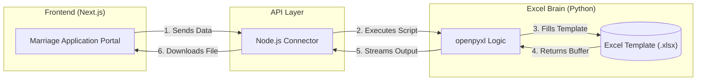

# 💍 LGU Solano Marriage Portal

A modern web application for generating Marriage License Application packs.

---

## 🛠️ Step-by-Step Installation (For Beginners)

Follow these steps exactly to get the portal running on your computer.

### 1. Install Required Software
You need two things installed on your computer:
1.  **Node.js**: [Download here](https://nodejs.org/) (Click the one that says "LTS").
2.  **Python**: [Download here](https://www.python.org/downloads/) (Download the latest version). 
    *   **CRITICAL**: During Python installation, make sure to check the box that says **"Add Python to PATH"**.

### 2. Prepare and Start the Project

**Quick Start (Copy & Paste):**
If you have Git and Node.js installed, just copy and paste this single line into your terminal (Mac) or Command Prompt (Windows):

```bash
git clone https://github.com/Danncode10/Marriage-License-System.git && cd Marriage-License-System && npm run install-all && npm run start-portal
```

---

**Manual Steps:**
1. Open your **Terminal** or **Command Prompt**.
2. Clone the project:
    ```bash
    git clone https://github.com/Danncode10/Marriage-License-System.git
    ```
3. Enter the folder:
    ```bash
    cd Marriage-License-System
    ```
4. Install everything:
    ```bash
    npm run install-all
    ```
5. Start the portal:
    ```bash
    npm run start-portal
    ```

Every time you want to use the portal, simply repeat these steps.

---

## 🗺️ System Architecture



This project is split into two main parts: the **Website (UI)** and the **Excel Brain (Python)**.

### 1. The Frontend (`/ui`)
*   **Location**: `ui/src/app/marriage/page.tsx`
*   **Role**: This is what the user sees. It collects names, birthdays, and addresses.
*   **Connection**: When you click "Generate Marriage Pack", it sends data to the API Route.

### 2. The Bridge (`/ui/api/generate-excel`)
*   **Location**: `ui/src/app/api/generate-excel/route.ts`
*   **Role**: It acts as a messenger. It takes data from the website and triggers the Python script.

### 3. The Excel Brain (`/necessary`)
*   **Location**: `necessary/convert_to_excel.py`
*   **Role**: This is where logic happens. It maps data to specific Excel cells (like B8 or U12).
*   **The Template**: `necessary/data/APPLICATION-for-MARRIAGE-LICENSE.xlsx`

---

## 📂 Project Structure Guide

*   **`ui/`**: Contains the code for the website.
    *   `src/app/marriage/`: The form page.
    *   `src/components/ui/`: The buttons, inputs, and cards.
*   **`necessary/`**: Contains the Excel logic.
    *   `convert_to_excel.py`: **Edit this** if you need to change cell mappings.
    *   `data/`: Contains the Excel template and images.

---

## 📝 Common Tasks

### How do I change a cell mapping?
1. Open `necessary/convert_to_excel.py`.
2. Look for lines like `app_sheet['B8'] = to_up(g_first)`.
3. Change `'B8'` to the new cell address.

### How do I change the website colors?
1. Open `ui/src/app/globals.css`.
2. Edit the `--primary` (Blue) and `--secondary` (Yellow) hex codes.
